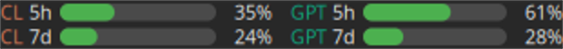
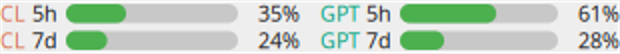
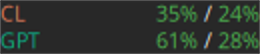
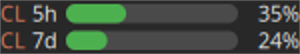

# Applet «Uso de IA» para el panel de MATE

Barras de uso de **Claude** y **ChatGPT** directamente en el panel de MATE:
la ventana de sesión (5 h) y la semanal (7 d) de cada servicio, con el mismo
dato que muestran `/usage` en Claude Code y `/status` en Codex CLI.



Sucesor de `claude-usage-applet`: el instalador retira la versión anterior y
la sustituye en el panel conservando su posición.

## De dónde salen los datos

| Servicio | Credencial local | Endpoint |
|---|---|---|
| Claude | `~/.claude/.credentials.json` | `api.anthropic.com/api/oauth/usage` |
| ChatGPT | `~/.codex/auth.json` | `chatgpt.com/backend-api/codex/usage` |

El applet **lee** esos archivos en cada sondeo (cada 5 minutos por omisión);
no los modifica ni refresca los tokens, y cada token viaja únicamente al
servicio que lo emitió. Si no has iniciado sesión en alguno de los dos CLI,
esa columna muestra `⚠ sin sesión` y la otra sigue funcionando.

Los porcentajes de ChatGPT son los de tu plan tal como los reporta Codex; con
un plan Plus/Pro son los mismos límites que consume la app.

## Requisitos

- MATE Panel (probado en Linux Mint MATE / Ubuntu MATE 24.04, mate-panel 1.26).
- `sudo apt install gir1.2-matepanelapplet-4.0 gir1.2-pango-1.0 python3-gi python3-gi-cairo`
- [Claude Code](https://claude.com/claude-code) y/o [Codex CLI](https://developers.openai.com/codex/cli)
  con sesión iniciada en esta máquina.

## Instalación

```bash
git clone https://github.com/badbit/mate-ai-usage-applet.git
cd mate-ai-usage-applet
bash install.sh
```

Pide **sudo una sola vez**, para copiar el descriptor a
`/usr/share/mate-panel/applets/`: mate-panel 1.26 ignora `XDG_DATA_DIRS` y solo
escanea esa ruta del sistema.

Si el applet anterior estaba en el panel, el nuevo hereda su sitio (se guarda
un respaldo de la configuración del panel en `~/.cache/mate-ai-usage-applet/`).
Si no, añádelo con clic derecho en el panel → **Añadir al panel…** → **Uso de IA**.

Opciones del instalador:

| Opción | Efecto |
|---|---|
| `--link` | Enlaza el script al repo en vez de copiarlo (cómodo para desarrollar). |
| `--no-migrate` | No toca la configuración del panel (dconf). |
| `--uninstall` | Desinstala y quita el applet del panel. |

Tras un `git pull`, vuelve a ejecutar `bash install.sh` (salvo que instalaras
con `--link`) y reinicia el panel con `mate-panel --replace &`.

## Configuración

Opcional, en `~/.config/mate-ai-usage-applet.json`:

```json
{
  "layout": "grid",
  "providers": ["claude", "chatgpt"],
  "poll_seconds": 300,
  "rotate_seconds": 6,
  "column_width": 150,
  "gap": 10,
  "font": "Sans 8"
}
```

| Clave | Predeterminado | Descripción |
|---|---|---|
| `layout` | `grid` | `grid`, `compact` o `rotate` (ver abajo). |
| `providers` | ambos | Lista y orden de servicios: `claude`, `chatgpt`. |
| `poll_seconds` | `300` | Intervalo de sondeo, mínimo 30 s. |
| `rotate_seconds` | `6` | Solo en `rotate`: segundos por servicio. |
| `column_width` | `150` | Ancho en píxeles por servicio. |
| `gap` | `10` | Separación entre columnas. |
| `font` | `Sans 8` | Baja sola a `Sans 7` en paneles de menos de 24 px. |

Reinicia el panel (`mate-panel --replace &`) para aplicar los cambios.

**`grid`** — una columna por servicio, filas 5 h y 7 d (310 px):


El mismo modo con tema claro:



**`compact`** — solo porcentajes, 5 h / 7 d (130 px):



**`rotate`** — un servicio a la vez, alternando (150 px):



Clic izquierdo sobre el applet: refresca ya y, en `rotate`, pasa al siguiente
servicio. El tooltip detalla porcentajes, plan y cuándo reinicia cada ventana.

Con **clic derecho** puedes marcar o desmarcar **Mostrar Claude Code** y
**Mostrar Codex**. El cambio se aplica de inmediato y se recuerda en
`~/.config/mate-ai-usage-applet.json`; no consulta ni muestra las credenciales
del servicio oculto. Puedes volver a marcar Claude Code cuando renueves la
suscripción.

## Diagnóstico

```bash
~/.local/bin/mate-ai-usage-applet.py --check     # datos en texto
~/.local/bin/mate-ai-usage-applet.py --preview /tmp/a.png   # cómo se ve
```

| Síntoma | Causa habitual |
|---|---|
| `⚠ sin sesión` | Falta el archivo de credenciales: inicia sesión con `claude` o `codex login`. |
| `⚠ sesión caducada` | El token guardado expiró: abre el CLI correspondiente una vez para que lo renueve. |
| `⚠ sin red` | Sin conexión; el applet reintenta en el siguiente sondeo. |
| No aparece en «Añadir al panel…» | Falta el descriptor del sistema: reejecuta `bash install.sh` y luego `mate-panel --replace &`. |

Las consultas se hacen en un hilo aparte, así que un fallo de red nunca
congela el panel.

## Desinstalar

```bash
bash install.sh --uninstall
```

## Licencia

MIT — ver [LICENSE](LICENSE).
